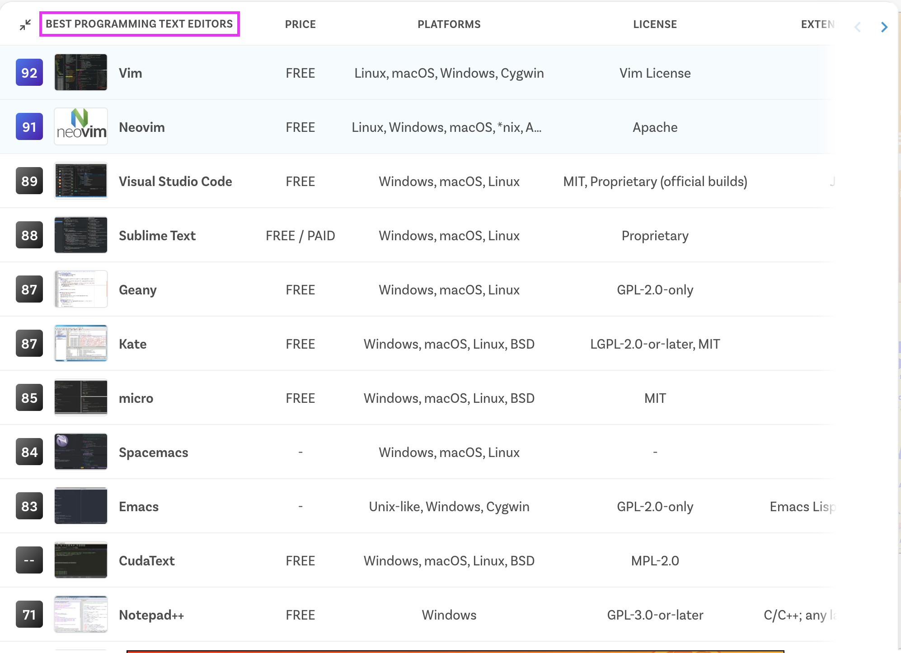
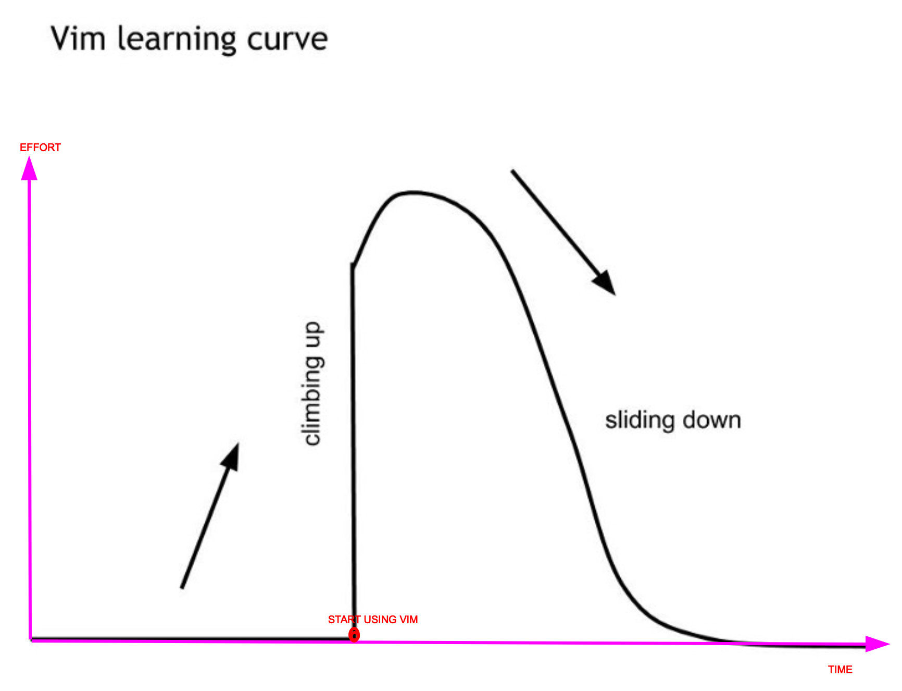
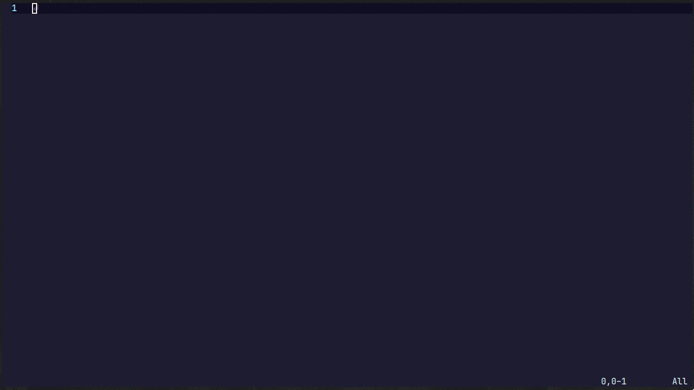
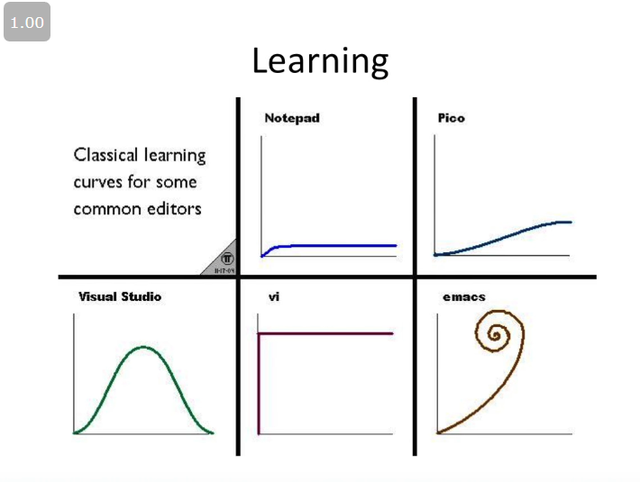
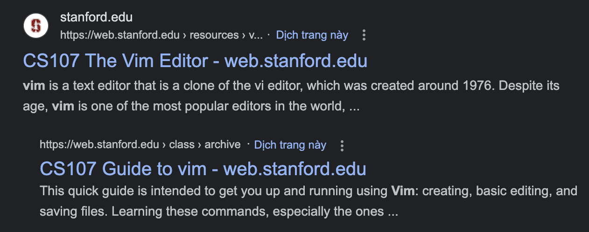
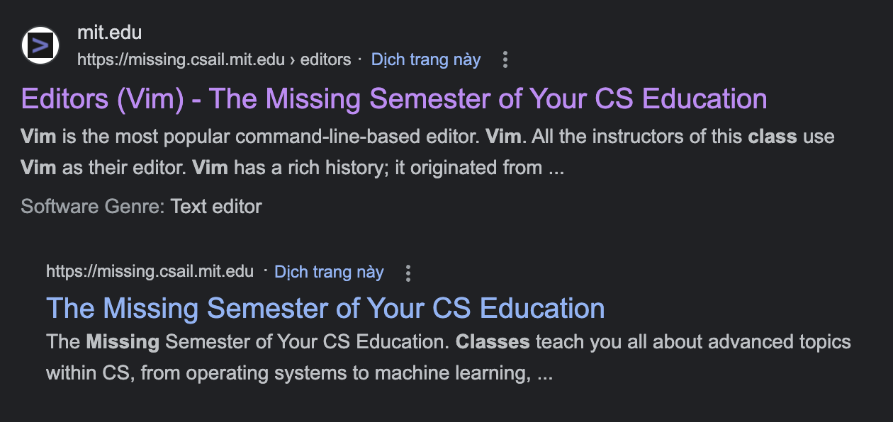

# NEOVIM INTRODUCTION
My thoughts about using Neovim and some hands-on practices to start with it.

## Outline
1. Overview
- Vim introduction
- Outstanding points of Vim
2. Vim to Neovim
- The evolution from Vim to Neovim
3. Kickstart with Neovim
- The guideline to start with NeoVim from my painful points in the past.
4. Neovim Plugins
- Neovim plugins to make your Neovim work as an IDE.
5. Neovim Challenges
- The Neovim World is not pink.
6. Conclusion
  
## Overview
Vim is an improved version of Vi with more features.
Vim is a command line text editor on Linux, macOS, and Windows. Vim is the most popular editor in the world.

Outstanding points of Vim compared to other similar tools:
1. The most vital mindset of Neovim is all needed keyboards on the Alpha area (with `h`, `j`, `k`, and `l` for movement).
It avoids moving from the alpha area to the arrow area on the keyboard and vice versa (similar to moving from the keyboard to the mouse).

2. Vim is lightweight and can run on many environments. (on different kinds of machines: Server, Local Machine, or different kinds of operating systems Linux macOS Windows)

3. Fast and aligned shortcuts by the community. We don't need to create a lot of shortcuts by ourselves, just need to learn Neovim shortcuts by default.
   
4. When you are familiar with the Vim movement, you can use tools inspired by Vim to enhance productivity:
- LazyGit for Git Version Control.

- K9s for Kubernetes management.
  
- Tmux for panel and window management on the Terminal environment.

- Vimimum Extension on Chrome.

## Vim to Neovim
NeoVim is an open-source project that forked from Vim to resolve Vim's headache issues. 
Therefore, the NeoVim movement behaviors are the same as Vim.
Neovim has the following improvement points over Vim:
- Configure in Lua with awesome plugins and features: Tresiter, LSP config, Telescope...

- The community support from Neovim is better than Vim: Neovim has 66.8 Github stars (On Jun 18, 2023) and 1000 contributors while Vim has 30.5k with 195 contributors.

- Floating UI support to allow plugins to create smart UI/UX on the terminal environment.

- With lazy options, to speed up loading installed plugins at starting time.

- Nvim loads the config from the ~/.config/ but Vim is not. Vim's config file is `~/.vimrc`. Centralize configuration in the ~/.config/ folder could back up easily later.

## How to start with NeoVim
For beginners, Neovim or Vim is really hard at the beginning time.

To get used to it, you could follow my proposal roadmap:
1. Firstly, to get used To with Neovim, you could walk around with the command: `vimtutor`. After getting familiar with the Neovim style, you could switch to using NeoVim officially.

2. Secondly, I highly recommend you try using Vim mode in your existing IDE. It could help you avoid being overwhelmed by the Neovim world.

3. Try with a Nvim Pre-configured Project.
- There are 2 most popular Neovim pre-configured projects: NVChad and LunarNeovim.
(I prefer the NVChad because its structure is simple and easy to extend with detailed docs)

4. Learn Lua and build your customized Neovim configuration. Here is step by step to configure your customized Neovim:

- Plugins Managemer (Lazy Nvim, Packer,...)

- Nvim configuration structure: You could take a look at my [Minimal Neovim Configuration](https://github.com/lexuancuong/nvim).

- Choose needed plugins depending on your demand.

- Key mappings for internal components and installed plugins. (**Tips**: Map `Caps lock` as `Esc` for quick movement).

- Set up LSP for Neovim with your expected programing language and coding style.

5. [Optional] Join the community about Neovim to learn more about the Neovim world:
- Reddit: https://www.reddit.com/t/neovim/

## Neovim Plugins
You already knew the Neovim with a lot of great features in the previous part.
In this part, I will show Neovim plugins that you could install to make Neovim work as an IDE.
- Nvim-tree: A File Explorer For Neovim Written In Lua

- Tresiter for Syntax Highlighting.

- LSP-config for integrating with LSP and Nvim-cmp for auto-completion.
The Language Server Protocol (LSP) defines the protocol used between an editor or IDE and a language server that provides language features like auto complete, go to definition, find all references, etc.

- Telescope for searching, and previewing files, and words.
|  |
|:--:|
| *(source: Telescope Github Repo)* |

- Git signs for Git Integration.
https://github.com/lewis6991/gitsigns.nvim

- Hop to quickly move the cursor to anywhere on the current view.

- Null-ls for code auto-formating.

Awesome plugins list:
https://github.com/rockerBOO/awesome-neovim

Tips: Because Neovim can easily insert debugging code (log something or breakpoint() in Python) and switch to executing terminal panel,
I don't use any debugger plugin with Neovim in Python. In case, you need a debugger tool in Neovim, [nvim-dap](https://github.com/mfussenegger/nvim-dap) could help you.

## Neovim Challenges
Challenges with NeoVim:
1. Take a lot of time and effort at the beginning time.

|  |
|:--:|
| *Vim learning curve with other tools (source: Internet)* |

*Vim learning curve with other tools*

2. Need a big motivation and an open mindset to bare with Neovim at the beginning time and effort to get familiar with it day by day.

||
|:--:|
| *Need an optimized work philosophy (source: Steen Schledermann)* |

## Conclusion
- With a lot of benefits for productivity, Vim or Neovim is recommended by many famous universities for programming students or software engineers and developers.

For choosing an IDE, there is no best solution, just go ahead with your most suitable or familiar one.

Take everything with a grain of salt. Just be yourself.

## Appendix:
Vim quick guide:

It is a lightweight editor with 4 main modes: Normal, Insert, Visual, and Command with these usages:
- In Normal mode (press <Esc> to enter this mode): you can easily move the cursor with h,j,k,l, or by other shortcuts.
- In Insert Mode (from Normal mode, press <i> to enter this mode): You could edit the text at the current cursor.
- In Visual mode (from Normal mode, press <v>): You can select your words and then have follow-up action (often yank).
- Command mode: (from Normal mode, press <:>) for running a command.
